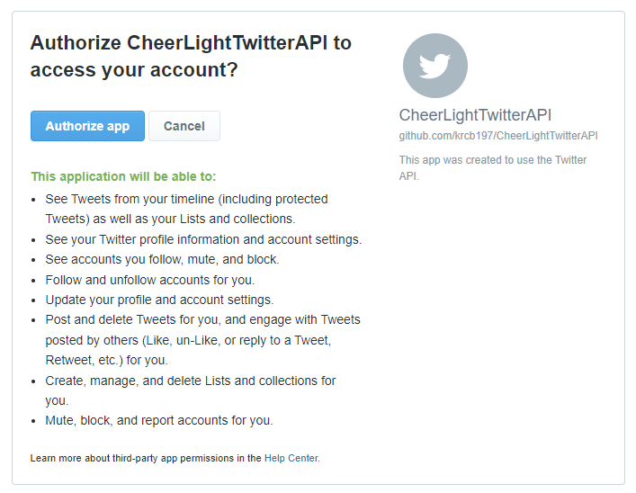

# CheerLightTwitterAPI
Generate tweets to for Cheerlights

# Installation

This tool runs on Python 3.10, 3.9 and 3.8 ( I suggest you use 3.10 as that is the latest version)

To install the required packages 

```bash
pip install -r requirements.txt
```

# Preparation

In order to use this library you will need twitter API keys

> :warning: **WARNING**: Please be careful not to expose Twitter API keys. **DO NOT** share them with other people or upload them to a cloud repository without care 

The twitter access keys are split into two parts:

| Syntax      | Description                                        |
| ----------- | -------------------------------------------------- |
| Consumer    | These are the credentials for the application      |
| Access      | These are the credentials for the user             |

These are then accessed by the class in one of two ways (in this order of priority):

1. A file called ```consumer_twitter_credentials.json``` and ```access_twitter_credentials.json``` 
   which is in the working directory (this is not  stored into GitHub), refer to
   ```example_consumer_twitter_credentials.json``` and 
   ```example_access_twitter_credentials.json``` for the example format
2. Via the following four environment variables, this is the recommended way to pass keys within a
   cloud environment e.g. GitHub from the repository secrets:
      - ```TWITTER_API_KEY```
      - ```TWITTER_API_SECRET```
      - ```TWITTER_ACCESS_TOKEN```
      - ```TWITTER_ACCESS_SECRET```

There are two methods to get these keys:
1. Set up a Twitter Developer Account and generate a complete set of keys, see, 
   [How to get access to the Twitter API](https://developer.twitter.com/en/docs/twitter-api/getting-started/getting-access-to-the-twitter-api)
2. Obtain the consumer keys from someone who already has configured an application. Then generate 
   the access Keys for your own Twitter account

The easiest way to generate the access keys is as follows: 

1. Run the command line application with the ```-g``` command line option (a coloru is still needed):  
   ```bash
   python -m src.cheer_lights_twitter_api purple -g
   ```
2. This will provide a weblink in the console and the option to enter a PIN (note the link below is not real)
   ```
   Authorization URL: https://api.twitter.com/oauth/authorize?oauth_token=xxxxxxxxx
   PIN:
   ```
   Copy this link to a webbrowser
3. The Webbrowser should look like this:
   
   If you agree by selecting _Authorise app_ it will take you to a screen showing a PIN number
   which must be typed into the python console. 
4. After entering it you will be given the choice to write the access key to a file. If you don't
   it will be only used for the one session. IF you Confirm and write it to a file next time you 
   can drop the ```-g``` command line switch

# Usage

This can be used in one of two ways

## Command Application

The file can be called usin the command line:

For example to generate a tweet with the color red
```bash
python cheer_lights_twitter_api.py red
```
The command line help has the full list of colour and other options
```bash
python cheer_lights_twitter_api.py -h
```

## As a Python class

There are two ways to use the class:
- In a python context manager (the connection to the twitter is managed automagically)
- Where the connection is persistent (this would be the approach if the object is instantiated in
  another class )

### Context Manager Example
```python
# import the colour enum
from cheer_lights_twitter_api import CheerLightColours
# import the tweeting API class
from cheer_lights_twitter_api import CheerLightTwitterAPI

with CheerLightTwitterAPI() as cheer_lights:
    cheer_lights.tweet(CheerLightColours[CheerLightColours.RED])

```

### Manual Connect / Disconnect
```python
# import the colour enum
from cheer_lights_twitter_api import CheerLightColours
# import the tweeting API class
from cheer_lights_twitter_api import CheerLightTwitterAPI

cheer_lights = CheerLightTwitterAPI()
cheer_lights.connect()
# make a tweet with the colour red
cheer_lights.tweet(CheerLightColours[CheerLightColours.RED])
cheer_lights.disconnect()

```

# Advanced Usage

The payload of the tweet is constructed using [Jinja](https://jinja.palletsprojects.com/en/3.0.x/)
this is a templating language used in many web engines, it allows the payload of the tweet to
be changed without needing to edit the core code.

The payload can be edited by changing the the ```tweet.jinga``` file in the src.templates

However, if you want to change the template without changing the code from the repository you 
can do one of the following:

## Derived Class

Build a derived class from the ```CheerLightTwitterAPI``` and overload the ```tweet_payload```
method. At this poitn you are bypassing the all the jinja templates

```python
from typing import Union

class MyCheerLightTwitterAPI(CheerLightTwitterAPI):

    def tweet_payload(self, colour: Union[CheerLightColours, str], jinja_context) -> str:
       
        #type check the colour parameter
        self.verify_colour(colour)
        
        if jinja_context is not None:
            raise NotImplementedError('jinja context is not supported')

        # build message using a jinga template
        if isinstance(colour, str):
            colour_str = colour
        elif isinstance(colour, CheerLightColours):
            colour_str = colour.name.lower()
        else:
            raise RuntimeError('unhandled colour type')
       
        return f'My tweet {colour_str}'
```

## User Jinja template

When initialising the ```CheerLightTwitterAPI``` class pass in the string name for your own 
folder of templates and user context using 

for example put a file called ```tweet.jinja``` in a folder called ```custom_templates```. 

In this case we can extend the template with a new parameter: ```user```

```jinja
@cheerlights {{ colour }} from {{ user }}
```

In this case the ```CheerLightTwitterAPI``` is then created with a new context which extends
the jinja context with a new parameter called ```user```

```python
custom_context = {
        'user' : 'Bob'
    }

with CheerLightTwitterAPI(user_template_dir='custom_templates',
                            user_template_context=custom_context) as dut:
    dut.tweet(colour='orange')
```
This will create a tweet with the following payload: `@cheerlights orange from Bob`

As well as items that are populated into the template when the object is initialised, it is 
also possible to have context inserted when the tweet is generated

Consider the following template

```jinja
@cheerlights {{ colour }} from {{ user }} to {{ other_user }}
```

```python
custom_context = {
        'user' : 'Bob'
    }

with CheerLightTwitterAPI(user_template_dir='custom_templates',
                            user_template_context=custom_context) as dut:
    dut.tweet(colour='orange', jinja_context={'other_user': 'Alice'})
    dut.tweet(colour='orange', jinja_context={'other_user': 'Jennie'})
```

This will create a tweet with the following payloads:
- `@cheerlights orange from Bob to Alice`
- `@cheerlights orange from Bob to Jennie`

The custom context is not limited to strings, any data type support by Jinja rendering will work

```python
custom_context = {
        'user' : 'Bob'
    }

with CheerLightTwitterAPI(user_template_dir='custom_templates',
                            user_template_context=custom_context) as dut:
    dut.tweet(colour='orange', jinja_context={'other_user': 99})
    dut.tweet(colour='orange', jinja_context={'other_user': 101})
```

This will create a tweet with the following payloads:
- `@cheerlights orange from Bob to 99`
- `@cheerlights orange from Bob to 101`

# Development and Testing

During Development, it may be useful to stop:
- The connection being made to the Twitter API (prehaps because you haven't got the keys)
- Tweets from being generated, because it is annoying deleting them all

This can be avoided as follows:
```python
with CheerLightTwitterAPI(suppress_tweeting=True) as dut:
    dut.tweet(colour='orange')
```

The same thing can be achieved by setting the ```-s``` switch when running from the command line

Similarly all connections and tweets are suppressed as follows:

```python
with CheerLightTwitterAPI(suppress_connection=True) as dut:
    dut.tweet(colour='orange')
```

The same thing can be achieved by setting the ```-c``` switch when running from the command line


